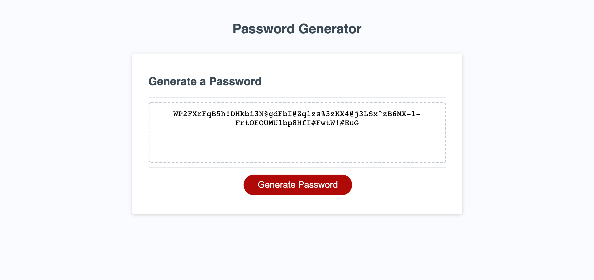

# Password Generator

## Description
This is the third assignment for coding bootcamp. The password generator prompts the user to choose number of characters (8-128) as well as whether they want to include uppercase, lowercase, numbers, and special characters. After prompts are complete, it will generate a password with the specifications the user chose.

### Screen Capture

#### Link to Password Generator

[Password Generator URL](https://kelseysanderson.github.io/password_generator/)
